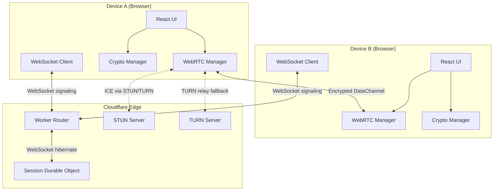
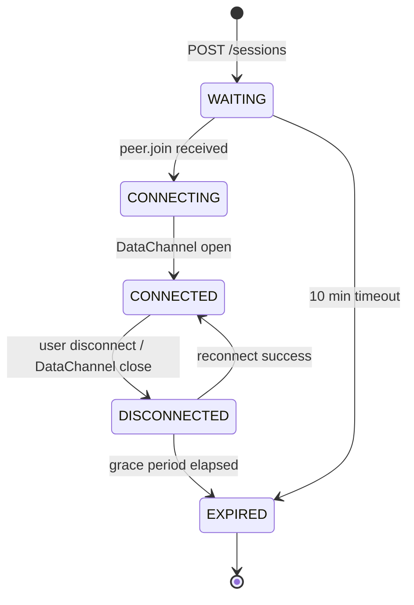

# Design Document: Kleepee V1

## Overview

Kleepee V1 is a browser-based peer-to-peer text sharing utility. Two devices establish a direct encrypted WebRTC DataChannel connection brokered by a lightweight Cloudflare Worker signaling server. Text never touches the server — the signaling layer only relays SDP offers/answers and ICE candidates.

The flow is:
1. Device A pastes text and clicks Share → session created → QR code shown
2. Device B scans QR → navigates to join URL → WebRTC handshake via signaling server
3. DataChannel opens → initial text transmitted encrypted → both devices can exchange text freely
4. Session expires or either device disconnects to end the session

### Key Design Decisions

- **URL fragment for sessionSecret**: The `#fragment` is never sent to the server in HTTP requests, ensuring the encryption key is never server-visible. This is the core security guarantee.
- **Durable Objects for session state**: Each session lives in a single Durable Object instance, giving us consistent state and WebSocket hibernation support without a database.
- **AES-GCM with HKDF key derivation**: sessionSecret → HKDF → AES-GCM key. Random IV per message, IV prepended to ciphertext. Provides authenticated encryption.
- **No TURN credentials in client bundle**: TURN credentials are short-lived tokens generated server-side and injected into ICE server config at session creation time, avoiding exposure in static assets.
- **React state machine via `useReducer`**: Session state transitions (`WAITING → CONNECTING → CONNECTED → DISCONNECTED → EXPIRED`) are modeled as a reducer to make transitions explicit and debuggable.

---

## Architecture



### Session State Machine



### Deployment Topology

```
Cloudflare Pages          Cloudflare Workers
┌─────────────────┐      ┌──────────────────────────────┐
│  React/Vite SPA │      │  Worker Router (index.ts)    │
│  kleepee.app    │─────▶│  POST /sessions              │
│                 │      │  GET  /sessions/:id          │
│                 │      │  WS   /sessions/:id          │
└─────────────────┘      │                              │
                         │  Session Durable Object      │
                         │  (per-session state + WS)    │
                         └──────────────────────────────┘
```

---

## Components and Interfaces

### Frontend Module Map

```
src/
├── lib/
│   ├── device.ts       — DeviceManager
│   ├── crypto.ts       — CryptoManager
│   ├── webrtc.ts       — WebRTCManager
│   ├── qr.ts           — QRManager
│   └── clipboard.ts    — ClipboardManager
├── hooks/
│   ├── useDevice.ts
│   ├── useSession.ts
│   └── useWebRTC.ts
├── pages/
│   ├── HomePage.tsx
│   ├── WaitingPage.tsx
│   ├── ConnectedPage.tsx
│   └── JoinPage.tsx
├── components/
│   ├── TextFeed.tsx
│   ├── TextCard.tsx
│   ├── QRCode.tsx
│   ├── StatusBar.tsx
│   └── TextInput.tsx
└── types/
    └── index.ts
```

### DeviceManager (`src/lib/device.ts`)

```typescript
interface DeviceIdentity {
  deviceId: string;   // UUID v4
  deviceName: string; // "Adjective Animal"
}

function loadOrCreateIdentity(): DeviceIdentity
// Reads localStorage keys kleepee.device.id and kleepee.device.name.
// If missing, generates both and persists them.

function generateDeviceName(): string
// Returns a random "Adjective Animal" string from a fixed word list.
```

### CryptoManager (`src/lib/crypto.ts`)

```typescript
function generateSessionSecret(): string
// Returns a 32-byte base64url-encoded secret via crypto.getRandomValues().

async function deriveKey(sessionSecret: string): Promise<CryptoKey>
// HKDF(SHA-256, sessionSecret, salt="kleepee-v1", info="aes-gcm-key") → AES-GCM 256-bit key

async function encrypt(key: CryptoKey, plaintext: string): Promise<Uint8Array>
// Random 12-byte IV. Returns IV || ciphertext (AES-GCM 256-bit).

async function decrypt(key: CryptoKey, data: Uint8Array): Promise<string>
// Splits IV from data, decrypts, returns UTF-8 string.
```

### WebRTCManager (`src/lib/webrtc.ts`)

```typescript
interface WebRTCCallbacks {
  onMessage: (data: Uint8Array) => void;
  onStateChange: (state: RTCDataChannelState) => void;
  onIceCandidate: (candidate: RTCIceCandidate) => void;
  onOffer: (offer: RTCSessionDescriptionInit) => void;
  onAnswer: (answer: RTCSessionDescriptionInit) => void;
}

class WebRTCManager {
  constructor(iceServers: RTCIceServer[], callbacks: WebRTCCallbacks)
  async createOffer(): Promise<RTCSessionDescriptionInit>
  async handleOffer(offer: RTCSessionDescriptionInit): Promise<RTCSessionDescriptionInit>
  async handleAnswer(answer: RTCSessionDescriptionInit): Promise<void>
  addIceCandidate(candidate: RTCIceCandidateInit): Promise<void>
  send(data: Uint8Array): void
  close(): void
}
```

### QRManager (`src/lib/qr.ts`)

```typescript
async function generateQRDataURL(url: string): Promise<string>
// Uses qrcode (npm) to produce a data: URL for the QR image.
// Called with https://kleepee.app/j/{sessionId}#{sessionSecret}
```

### ClipboardManager (`src/lib/clipboard.ts`)

```typescript
async function copyToClipboard(text: string): Promise<void>
// navigator.clipboard.writeText(text). Throws on permission denial.
```

### Signaling Client (inside `useSession.ts`)

The WebSocket signaling client is embedded in the `useSession` hook. It manages the WS lifecycle and dispatches incoming signaling messages to the WebRTC manager.

```typescript
// Messages sent to server
type ClientMessage =
  | { type: "signal.offer";  offer: RTCSessionDescriptionInit }
  | { type: "signal.answer"; answer: RTCSessionDescriptionInit }
  | { type: "signal.ice";    candidate: RTCIceCandidateInit }

// Messages received from server
type ServerMessage =
  | { type: "peer.join";     deviceName: string }
  | { type: "peer.leave" }
  | { type: "signal.offer";  offer: RTCSessionDescriptionInit }
  | { type: "signal.answer"; answer: RTCSessionDescriptionInit }
  | { type: "signal.ice";    candidate: RTCIceCandidateInit }
  | { type: "session.expired" }
```

### Worker Router (`worker/index.ts`)

```typescript
// Routes:
// POST /sessions         → creates Durable Object stub, returns { sessionId }
// GET  /sessions/:id     → fetches DO state, returns { state, deviceCount }
// GET  /sessions/:id/ws  → upgrades to WebSocket, delegates to DO
// (WS path also matches /sessions/:id for the WS upgrade)
```

### Session Durable Object (`worker/durable-object.ts`)

```typescript
class SessionDurableObject implements DurableObject {
  // State: Map of peerId → WebSocket
  // Tracks: sessionState, deviceCount, createdAt
  // Alarm: set on creation for 10-min WAITING expiry

  fetch(request: Request): Response | Promise<Response>
  // Handles HTTP GET (state) and WS upgrade

  webSocketMessage(ws: WebSocket, message: string): void
  // Routes signal.offer / signal.answer / signal.ice to peer

  webSocketClose(ws: WebSocket): void
  // Emits peer.leave, decrements count, sets expiry alarm if both gone

  alarm(): void
  // Expires session, broadcasts session.expired to any open sockets
}
```

---

## Data Models

### TypeScript Types (`src/types/index.ts`)

```typescript
export type SessionState =
  | "WAITING"
  | "CONNECTING"
  | "CONNECTED"
  | "DISCONNECTED"
  | "EXPIRED";

export interface TextItem {
  id: string;                  // UUID
  type: "text";
  senderId: string;            // deviceId of sender
  senderName: string;          // deviceName of sender
  timestamp: number;           // Unix ms
  content: string;             // Plaintext (post-decrypt)
}

export interface DeviceIdentity {
  deviceId: string;
  deviceName: string;
}

export interface SessionContext {
  sessionId: string;
  sessionSecret: string;
  state: SessionState;
  role: "initiator" | "joiner";
  peerDeviceName: string | null;
  items: TextItem[];
}
```

### Durable Object State (in-memory, not persisted)

```typescript
interface DOState {
  sessionState: "WAITING" | "CONNECTING" | "CONNECTED" | "DISCONNECTED" | "EXPIRED";
  peers: Map<string, WebSocket>;  // peerId → WebSocket
  createdAt: number;              // Unix ms
}
```

### Wire Format (DataChannel messages)

Each DataChannel message is a binary `Uint8Array` containing:
```
[ 12-byte IV ][ AES-GCM ciphertext of UTF-8 JSON ]
```

The decrypted JSON matches the `TextItem` interface above.

### Signaling Wire Format (WebSocket messages)

JSON text frames, discriminated by `type` field. See `ClientMessage` / `ServerMessage` union types above.

### localStorage Keys

| Key | Value |
|-----|-------|
| `kleepee.device.id` | UUID string |
| `kleepee.device.name` | "Adjective Animal" string |

---

## Correctness Properties

*A property is a characteristic or behavior that should hold true across all valid executions of a system — essentially, a formal statement about what the system should do. Properties serve as the bridge between human-readable specifications and machine-verifiable correctness guarantees.*

### Property 1: Device identity stability

*For any* localStorage state that already contains `kleepee.device.id` and `kleepee.device.name`, calling `loadOrCreateIdentity()` any number of times should always return the exact same deviceId and deviceName without writing new values to localStorage.

**Validates: Requirements 1.3**

### Property 2: Device identity creation

*For any* empty localStorage, calling `loadOrCreateIdentity()` should produce a non-empty UUID-shaped string for deviceId and a non-empty two-word string for deviceName, and both values should be persisted at the correct localStorage keys.

**Validates: Requirements 1.1, 1.2**

### Property 3: Encryption round trip

*For any* sessionSecret string and *for any* non-empty plaintext string, deriving a key from the secret and then encrypting followed by decrypting should return a string byte-for-byte equal to the original plaintext.

**Validates: Requirements 5.1, 5.2, 5.3**

### Property 4: Encryption non-determinism

*For any* AES-GCM key and *for any* plaintext string, calling `encrypt` twice with the same inputs should produce two ciphertext byte arrays that are not equal to each other (because each call generates a fresh random IV).

**Validates: Requirements 5.2**

### Property 5: SessionSecret URL fragment placement

*For any* sessionId and sessionSecret, the join URL constructed from those values should contain the sessionSecret exclusively in the URL fragment (`#`), and the URL path and query string should contain no part of the sessionSecret.

**Validates: Requirements 2.4, 5.4**

### Property 6: Join URL parse round trip

*For any* sessionId and sessionSecret, constructing the join URL and then parsing it back should recover the original sessionId from the path and the original sessionSecret from the fragment.

**Validates: Requirements 3.1**

### Property 7: TextItem serialization round trip

*For any* valid `TextItem` object (with all required fields: `id`, `type`, `senderId`, `senderName`, `timestamp`, `content`), serializing to JSON and then deserializing should produce an object deeply equal to the original, and the `type` field should be the string `"text"`.

**Validates: Requirements 12.1, 12.2, 12.4**

### Property 8: Oversized message rejection

*For any* string whose UTF-8-encoded byte length exceeds 65536, attempting to send it should be rejected, an error message should be surfaced, and the text feed should remain unchanged.

**Validates: Requirements 6.5**

### Property 9: Content type classification

*For any* string that successfully parses as a URL, the content classifier should return type `"url"`. *For any* string that matches an email address pattern, it should return type `"email"`. *For any* other non-empty string that is neither a URL nor an email, it should return type `"text"`.

**Validates: Requirements 7.2, 7.3, 7.4**

### Property 10: Malformed message safety

*For any* byte sequence received on the DataChannel that either fails AES-GCM decryption or whose decrypted content fails JSON deserialization, the text feed items list should remain unchanged and no unhandled exception should propagate to the UI layer.

**Validates: Requirements 12.3**

### Property 11: Session capacity enforcement

*For any* signaling session that already has two peers connected, a third peer's WebSocket connection attempt should be rejected (HTTP 409 or WS close 4409), and the two existing peers' connections should remain unaffected.

**Validates: Requirements 3.4, 9.4**

### Property 12: Signaling relay completeness

*For any* signaling message of type `signal.offer`, `signal.answer`, or `signal.ice` sent by one peer in a two-peer session, the other peer should receive an identical copy of that message, and no third party should receive it.

**Validates: Requirements 4.1, 11.4, 11.5, 11.6**

### Property 13: ICE candidate forwarding

*For any* ICE candidate generated by the local RTCPeerConnection, the WebRTC manager should emit a `signal.ice` message containing that candidate to the signaling channel.

**Validates: Requirements 4.4**

### Property 14: Non-open DataChannel hides connected state

*For any* DataChannel state value other than `"open"` (i.e., `"connecting"`, `"closing"`, `"closed"`), the UI session state should not be `CONNECTED` and the "Connected to…" indicator should not be shown.

**Validates: Requirements 8.5**

---

## Error Handling

### Client-Side Errors

| Scenario | Handling |
|----------|----------|
| localStorage unavailable | Graceful fallback: generate identity in memory, show no-persistence warning |
| QR generation failure | Show text URL as fallback with copy button |
| Clipboard write denied | Show "Copy failed — select the text manually" inline message |
| DataChannel message > 64 KB | Block send, show inline error, do not transmit |
| Received malformed JSON | Discard silently, log to console, never crash |
| Decryption failure | Discard message, log warning, show no UI error |
| WebRTC ICE failure (no STUN) | Retry with TURN; if TURN also fails after 15s, show reconnection UI |
| WebSocket disconnect during signaling | Retry WS connection up to 3 times with exponential backoff |
| Session not found (404 on GET) | Show "Session not found" screen |

### Server-Side Errors

| Scenario | Handling |
|----------|----------|
| Durable Object unavailable | Worker returns 503; client retries with backoff |
| WebSocket upgrade failure | Return 400 with JSON error body `{ error: "..." }` |
| Third peer attempts to join | Return 409 Conflict; broadcast nothing |
| Session in EXPIRED state | Return 410 Gone on GET; close WS immediately with code 4410 |
| Alarm fires on active session | No-op if session has progressed past WAITING |

### Reconnection Strategy

When DataChannel closes unexpectedly (Requirement 8.2):
1. Immediately show "Reconnecting..." UI
2. Close existing `RTCPeerConnection`
3. Reopen WebSocket to signaling server
4. Re-run ICE/offer/answer negotiation as initiator
5. Retry up to 3 times with 2s / 4s / 8s delays
6. On final failure, show "Connection ended. [CREATE NEW SESSION]"

---

## Testing Strategy

### Dual Testing Approach

Both unit tests and property-based tests are required. They are complementary:
- Unit tests cover specific examples, integration points, and error conditions
- Property-based tests verify universal correctness across the full input space

### Unit Tests

Focus areas:
- **DeviceManager**: first-open creation, subsequent-open reload, localStorage key names
- **CryptoManager**: key derivation produces a CryptoKey, encrypt returns Uint8Array of correct minimum length
- **Content detection**: explicit examples for plain text, HTTP/HTTPS URLs, mailto-style emails, edge cases like `localhost`, IP addresses
- **TextItem serialization**: known fixture round trip
- **Signaling worker**: integration tests using Miniflare — POST /sessions returns 200 + sessionId, GET returns state, WS upgrade succeeds, third peer rejected with 409
- **Session expiry**: Miniflare alarm simulation triggers state → EXPIRED

### Property-Based Tests

Library: **fast-check** (TypeScript-native, works in Vitest)

Minimum **100 iterations** per property. Each test is tagged with a comment in the format:
`// Feature: kleepee-v1, Property <N>: <property_text>`

| Property | Test Description | fast-check Arbitraries |
|----------|-----------------|------------------------|
| P1: Identity stability | repeated `loadOrCreateIdentity()` → same values returned | `fc.uuid()` + `fc.string()` (pre-seeded localStorage) |
| P2: Identity creation | empty localStorage → non-empty id and name persisted | `fc.constant(null)` |
| P3: Encryption round trip | encrypt → decrypt → equals original plaintext | `fc.string({ minLength: 1 })` |
| P4: Encryption non-determinism | encrypt twice → two distinct ciphertexts | `fc.string({ minLength: 1 })` |
| P5: URL fragment placement | join URL → sessionSecret only in fragment | `fc.string()` sessionId + `fc.base64String()` secret |
| P6: Join URL parse round trip | build URL → parse → original id + secret recovered | `fc.string()` + `fc.base64String()` |
| P7: TextItem serialization round trip | arbitrary TextItem → JSON → parse → deepEqual | custom `fc.record(...)` arbitrary |
| P8: Oversized message rejection | string > 64 KB → rejected, feed unchanged | `fc.string({ minLength: 65537 })` + byte size check |
| P9: Content type classification | URL → "url", email → "email", other text → "text" | `fc.webUrl()`, `fc.emailAddress()`, `fc.string()` |
| P10: Malformed message safety | random bytes → no crash, feed unchanged | `fc.uint8Array()` |
| P11: Session capacity enforcement | third WS join → 409/4409, existing peers unaffected | Miniflare + `fc.integer()` |
| P12: Signaling relay completeness | any signal message → arrives at peer unchanged | Miniflare + `fc.constantFrom("signal.offer","signal.answer","signal.ice")` |
| P13: ICE candidate forwarding | RTCPeerConnection generates candidate → signal.ice emitted | mock RTCPeerConnection + `fc.record(...)` |
| P14: Non-open state hides connected UI | any state ≠ "open" → CONNECTED not shown | `fc.constantFrom("connecting","closing","closed")` |

### Test Runner Configuration

```typescript
// vitest.config.ts
export default {
  test: {
    environment: "jsdom",       // for localStorage, crypto
    globals: true,
    setupFiles: ["./src/test/setup.ts"],
  }
}
```

Worker tests use Miniflare's `@cloudflare/vitest-pool-workers` environment.

Property tests are run in CI with `vitest --run` (no watch mode). Each `fc.assert(fc.property(...))` call is configured with `{ numRuns: 100 }`.
